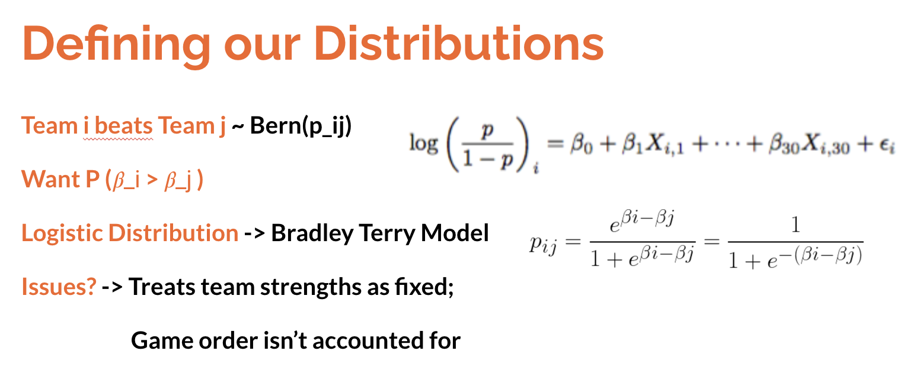
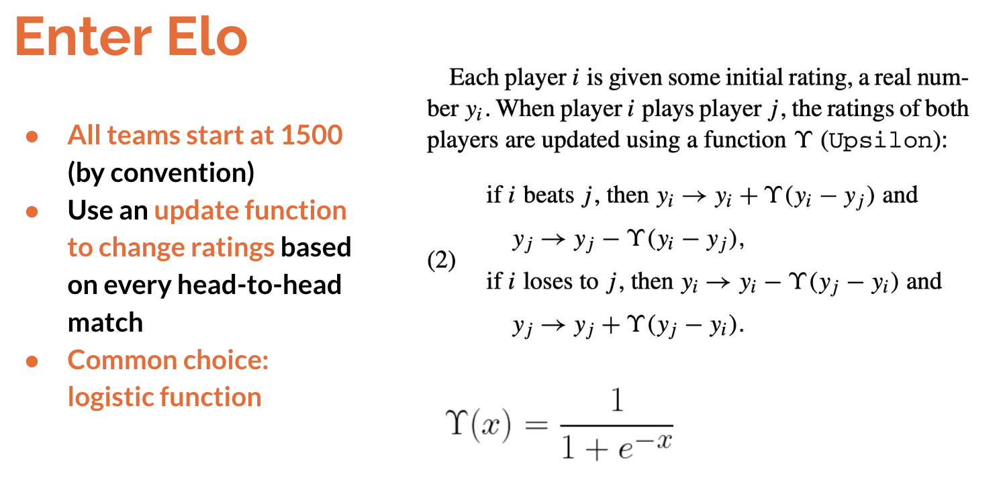
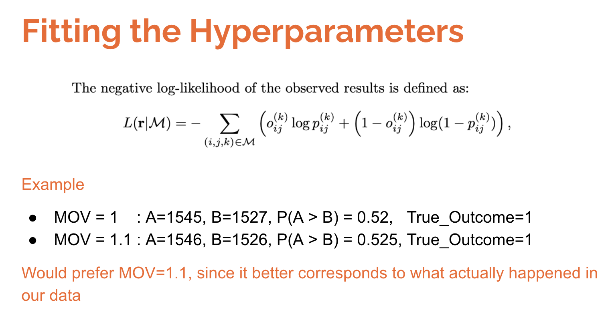
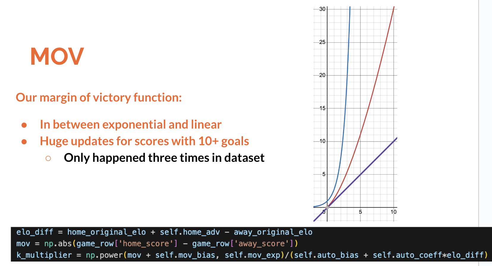
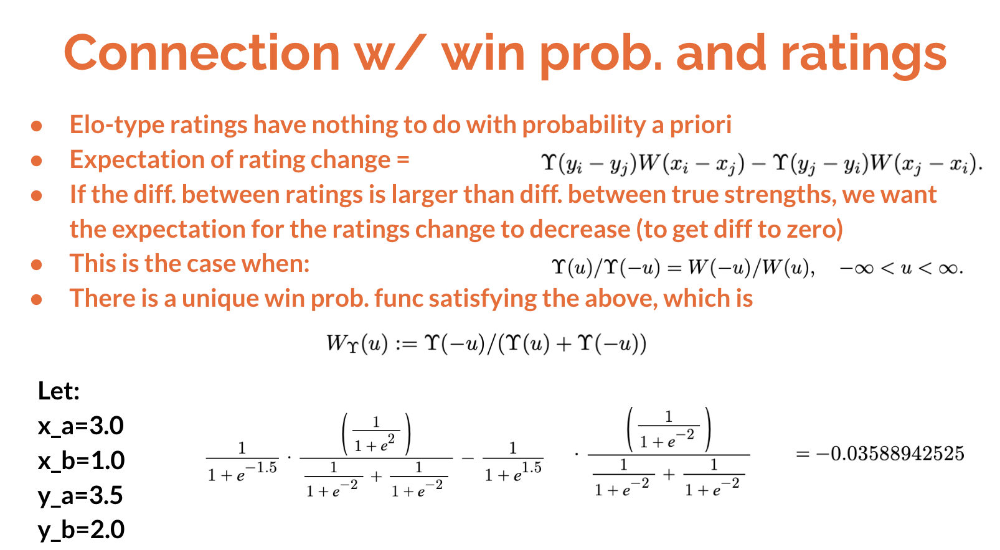

# Goal

Build a model to estimate team strengths using scores from NHL games

## Regression

We want to model team strengths. To do this, how should we think of this problem? We can think of an individual game between Team A and Team B as a Bernoulli random variable. If we want to predict the binary output of this bernoulli trial, we can frame it as a logistic regression problem, where we can write the response of a linear model as the link function of a member of the Exponential Family Distribution, giving us this equation.

So if we think of the regression coefficients for each team as their "numeric ratings", we can estimate these parameters and rank them based on their size. 

Equivalently, if we rewrite this equation in terms of p, we can see that we're basically passing the difference in "team strength" through a sigmoid/logistic function to get a probability that team A will win.

What are potential issues with this view? The logistic regression, otherwise known as the bradley-terry model when applied in this manner, is order-invariant. In other words, this treats team strengths as fixed and the order of games as unimportant. This is clearly not ideal, as we'd expect team strengths to change over time, for a multitude of different possible.
While there are ways to combat these problems within this framework, we can turn to a similiar approach/deviation to account for this.

## Enter Elo

So what's the elo algorithm?

Each team starts with the same numeric rating, conventionally set at 1500. We'll look at each game played and update the ratings based on the results. The key thing is that the size of these updates change based on how well we think they track the true underlying strength. We can infer that from how likely or unlikely our observed game result is, as described by a win probability function.

An explicit example: 
if we have a 1600 vs a 1400 team and the 1600 team wins, this doesn't tell us much. The 1600 should have won, so maybe they'll go up a little to 1602, and conversely the 1400 team is barely "punished" - they go down to 1398. 

But what if the 1400 pulled off an "upset" - well if they won, then their "true skill level" should probably be much higher than the initially thought 1400. So we'd probably want to update this more, to say 1450, and conversely the really good team would lose a lot, like to say 1550. Because if they were a team with a true ranking that high, it would have been very unlikely for them to lose that match.

So that's how we change our ratings. They're zero-sum, so if one team wins 10 points the other team loses 10. Generally, we choose our update function, such that when a team wins, they can only gain points - they can't lose points (joke). From a win, they can certainly lose points in general (smile).

## Connections to Logistic Regression
How does this relate to our previous discussion about logistic regression?

Because we're using a (scaled) logistic function as our update function, we get for free an implicity win-probability that is the logistic function under this framework.

The choice of base 10 and scale factor of 400 are chosen by convention, as Arpad Elo used these numbers to get ratings close to the scale used at the time to measure chess players ability.

Elo suggested scaling ratings so that a diff. of 200 rating points would mean that the stronger player has an expected score of around 75 perecnt.

## Final Equation (hyperparameters)

Our final update equation is a bit more complicated, as we wish to account for additional game factors.  

The K-factor in our equation is a standard part of the Elo method - it's a hyperparameter that changes the scale of our updates. A larger K-factor means we put more weight on recent games played (since our update will be larger). Conversely a smaller K implies we should not update so heavily based on one game.

To account for a team's advantage when playing on home ice, we add a fixed number of points to the home team's rating before each game.

We also have a hyperparameter alpha which is used at the start of each new season. What should we do with the previous season's rankings? Should we completely discard then and start each team back at 1500? Or should we not change them at all? Our alpha value is what percent of the team's previous rankings we use as a starting point for next season - similar to a prior we have on their ability entering the new season.

Our remaining hyperparamters involve adjusting our update size based on the winning team's margin of victory. Conceptually, one would think a team that wins by seven goals is better than a team that wins by one goal against the same opponent. We experimented with a couple different functions that involved multiple hyperparameters.

## Hyperparameter Values
My final value of K was 12. This is similar to 538's K-value range found in their NHL model, especially compared to their range for different sports like football and basketball. And intuitively this makes sense why our NHL model's K-value will be lower compared to sports like football and basketball - there is more game-to-game randomness in the NHL (as confirmed in Michael Lopez's paper on the subject).

Our final home advantage factor was 28. This means that if two equal teams of 1500 played each other, the home team (now at a ranking of 1528), would have a 54.0% chance of winning. From the observed data, we saw that 52.9% of NHL teams won their home games.

We found our optimal alpha to be 0.8 - so 80% of the previous year's rankings were retained. 

## Fitting 

But how did we come to these values for our hyperparameters? These are better than other values with respect to what? 

With our update function, we have our implicit win probability function which we can use to get the probability that a team will win. We can then judge our model based on how likely the teams who actually won were to win. 

Ideally, we'd know the "true" probability of this team winning, and change the hyperparameters such that our estimated probability is equal to this true probability. 

We obviously can't do this, but we can implicitly do this by instead comparing our estimated probabilities to the results of the game, which we do know. If a team wins, we want the probabilities of them winning to be higher. And if they lose, we want them to be lower.

This is our log loss that we optimize for.

## Optuna

How did we find these hyperparameters? Unfortunately, there's no closed-form way to calculate the optimal values. My default go-to hyperparameter optimization library is Optuna, in Python. Really any Bayesian optimization library is better than gridsearch or randomsearch. The gist of it is that it optimally balances the explore vs exploitation tradeoff using Bayesian updates from the observed trial results. Formally, it uses the Tree-structured Parzen Estimator to model the probability density of good hyperparameters and samples from there choices of hyperparameters to use for the next trial.

## Results
Now that we have our results, we can see the top and bottom teams in my Elo model. The top teams are Boston, Dallas, and LA, while the bottom teams comprise of Anaheim, San Jose, and Columbus. Overall, I liked the rankings - it definitely passes the sanity check.

A couple interesting notes:
1) Boston's probably so high in the model because of the lingering effects of last season's historic performance
2) Up to January 20th, when the data ends, LA had a better goal differential than their record would suggest, and a lot of overtime losses. 
3) Vancouver and Winnipeg are a bit lower in our rankings than they are in current standings, and this can be explained by their previous seasons' worse records.
4) Was a little surprised Anaheim was the worst instead of San Jose. I think it's a lot of reasons. Part of it is the model thinking Anaheim as the worst team from last year, and the Sharks have a couple more overtime losses than the Ducks up to this point. So if only just looking at the records, it's a bit closer than one might initially expect.

[('Boston', 1601.0646830062885),  
 ('Dallas', 1569.1801789013925),  
 ('Los Angeles', 1563.8708258194545),  
 ('Vegas', 1557.7539099876278),  
 ('NY Rangers', 1555.9303720837281),  
 ('Edmonton', 1552.9740681204003),  
 ('Colorado', 1541.9531224431455),  
 ('Toronto', 1541.5184317980422),  
 ('Florida', 1535.1913761667333),  
 ('Vancouver', 1531.948372825864),  
 ('New Jersey', 1526.673736305464),  
 ('Winnipeg', 1526.4320323336335),  
 ('Carolina', 1523.7123315519236),  
 ('NY Islanders', 1517.1365205801894),  
 ('Minnesota', 1513.5394754101887),  
 ('Pittsburgh', 1513.1017524918154),  
 ('Tampa Bay', 1509.2981279693201),  
 ('Ottawa', 1504.495804364711),  
 ('Calgary', 1495.25375627793),  
 ('Detroit', 1490.491511592243),  
 ('Nashville', 1489.3921438056927),  
 ('Seattle', 1485.9797718528791),  
 ('Washington', 1479.1863785530666),  
 ('Buffalo', 1478.0027510515351),  
 ('Philadelphia', 1472.0199002340705),  
 ('Arizona', 1464.0320799508745),  
 ('St Louis', 1458.4803593893769),  
 ('Montreal', 1415.3876024877038),  
 ('Chicago', 1404.1246463544846),  
 ('Columbus', 1403.6250618303206),  
 ('San Jose', 1390.9307099445173),  
 ('Anaheim', 1383.3402013173363)]  

## Other approaches

We could have also taken a Bayesian approach with a state-space model like Michael Lopez's (derived from Glickman). This actually gives us the nice benefit of having a distribution over our estimates of team abilities, rather than just a point estimate. However, I'm not extremely familiar with bayesian modeling, and while it's been on the bucket list, it wasn't something I wanted to do in such a short time frame.

But this is also an advantage for Elo - it's really good at getting a nice model running quickly with interprability.

## Validation data
Normal cross validation not appropriate for time series

Effectively use forward chaining

(diagram of what calculating over entire cross val dataset vs 
only next day). The cross val loss would be dominated by future 
games which in reality we would have more data available.
- Has to do with independence assumption?

Empirically not much of a difference, but up for discussion

## Margin of Victory functions

## Theoretical Basis

### Potential questions

Difference between Logistic Regression and Bradley-Terry Model?
- None. Just an application. Equivalent
Why log loss and not accuracy?
- modeling probabilities, so more informative to use log loss. p=0.51 and p=1 are equally wrong under accuracy metric, which is undesirable

## Diff architecture types
1) Convexity of bradley-terry/logistic models is interesting
    - arguably mathematically nicer
2) Bayesian modeling 
    - state-space modeling, get distributions rather than point estimates

## Use Draws

## K and Gradient Descent
